```{r setup, include=FALSE}
require(rmarkdown)
require(xaringan)
require(xaringanExtra)
require(knitr)
require(icons)
require(emo)
options(htmltools.dir.version = FALSE)
# preset code chunk options
knitr::opts_chunk$set(dpi = 300,            # ensures high resolution images
                      echo = FALSE,         # FALSE: code chunks don't show
                      warning = FALSE,      # FALSE: suppresses warning messages
                      error = FALSE,       # FALSE: Suppresses error messages
                      fig.align = "center")

```


```{r xaringan-slide-tone, echo=FALSE}
#xaringanExtra::use_slide_tone()
```


# Outline

<br/>

## Mechanisms of isolation
- Prezygotic
- Postzygotic

--

## Modes of speciation
- Allopatric speciation
- Sympatric speciation
- Parapatric speciation

--

## Limitations
- Cryptic species


---


.pull-left[

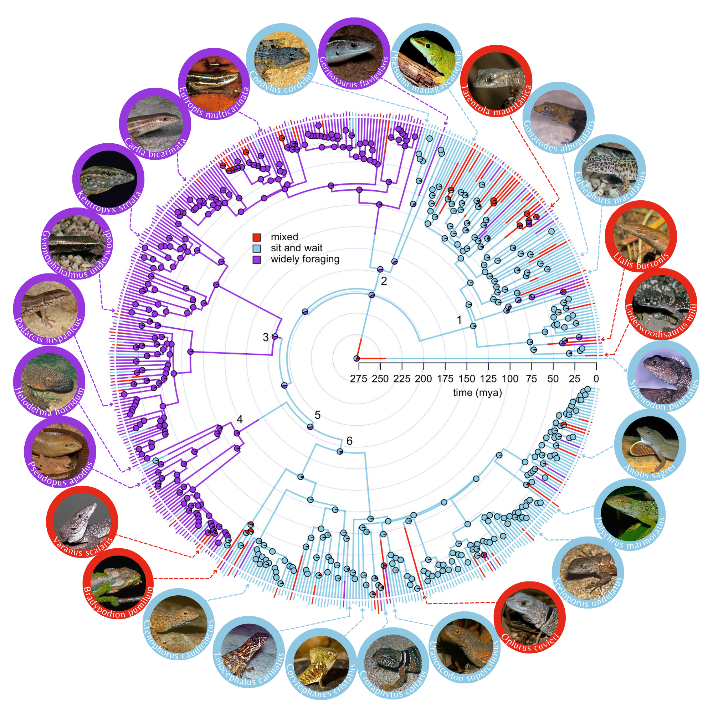

]


<center>

.pull-right[


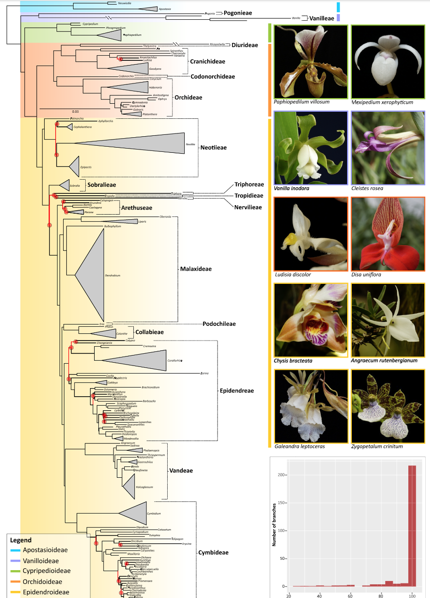


]

</center>


---
class: center, middle


# Why is the world strcutured like this? <br><br> How has this come about?


---


# Species

<br>

A group of organisms that are `r colorize("reproductively isolated", "orange")` from each other

--

<br>

<center>
What does `r colorize("reproductive isolation", "orange")` mean?
</center>

<br>

--


.pull-left[

`r colorize("Prezygotic", "purple")` - prevent fertilization of eggs

- Habitat isolation
- Temporal isolation
- Mechanical isolation
- Gametic isolation
- Behavioral isolation

]

--


.pull-right[

`r colorize("Postzygotic", "skyblue")` - prevent formation of fertile offspring

- Hybrid inviability
- Hybrid sterility
- Hybrid breakdown

]


---

# `r colorize("Prezygotic", "purple")` mechanisms of isolation


.pull-left[

<br><br><br>

- Habitat isolation

]

--


.pull-right[

<br>


]

---

# `r colorize("Prezygotic", "purple")` mechanisms of isolation


.pull-left[

<br><br><br>

- Habitat isolation
- Temporal isolation

]


.pull-right[


]

---

# `r colorize("Prezygotic", "purple")` mechanisms of isolation


.pull-left[

<br><br><br>

- Habitat isolation
- Temporal isolation
- Mechanical isolation

]


.pull-right[

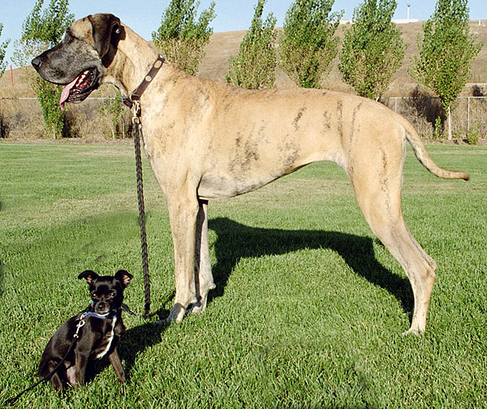


]

---

# `r colorize("Prezygotic", "purple")` mechanisms of isolation


.pull-left[

<br><br><br>

- Habitat isolation
- Temporal isolation
- Mechanical isolation
- Gametic isolation

]


.pull-right[

<br>

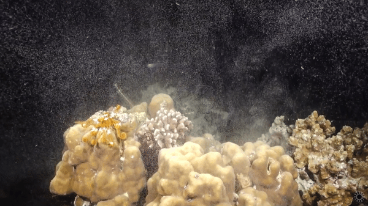


]

---

# `r colorize("Prezygotic", "purple")` mechanisms of isolation


.pull-left[

<br><br><br>

- Habitat isolation
- Temporal isolation
- Mechanical isolation
- Gametic isolation
- Behavioral isolation

]


.pull-right[

<br>


]


---

# `r colorize("Postzygotic", "skyblue")` mechanisms of isolation


.pull-left[

<br><br><br>

- Hybrid inviability

]


.pull-right[


]


---

# `r colorize("Postzygotic", "skyblue")` mechanisms of isolation


.pull-left[

<br><br><br>

- Hybrid inviability
- Hybrid sterility

]


.pull-right[


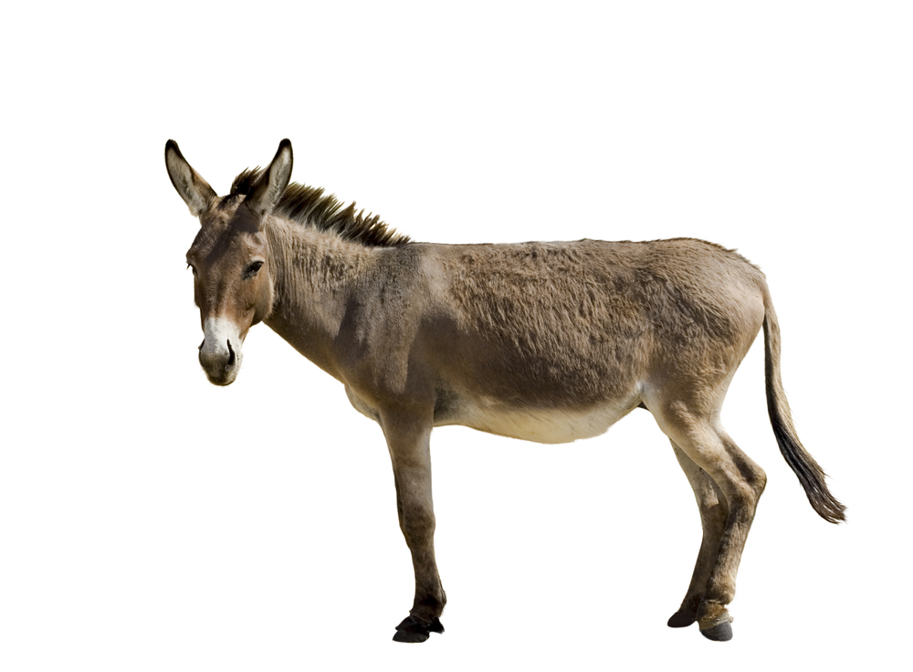


]


---

# `r colorize("Postzygotic", "skyblue")` mechanisms of isolation


.pull-left[

<br><br><br>

- Hybrid inviability
- Hybrid sterility
- Hybrid breakdown

]


.pull-right[


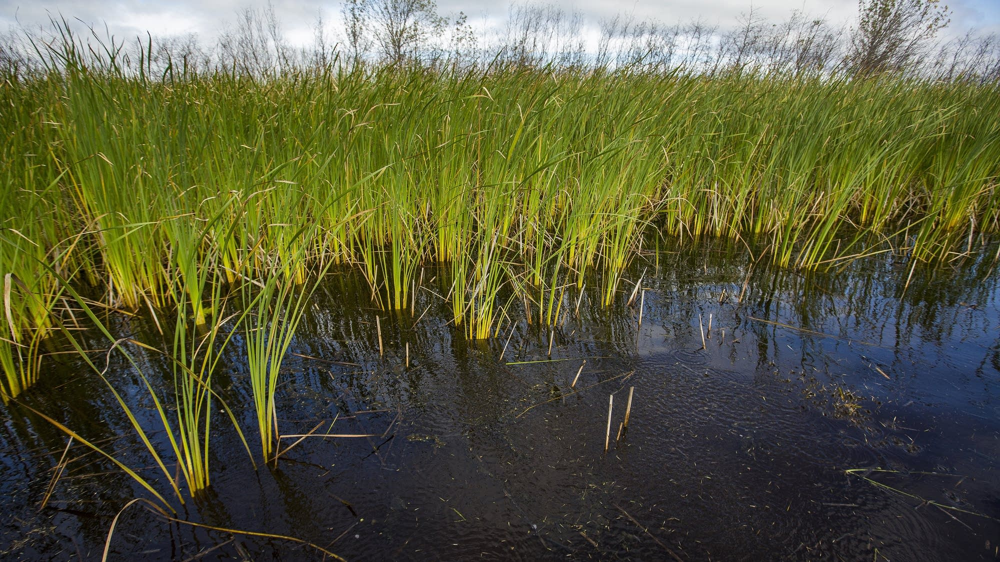


]


---
class: center, middle


# Modes of speciation


---

# Allopatric speciation

<center>
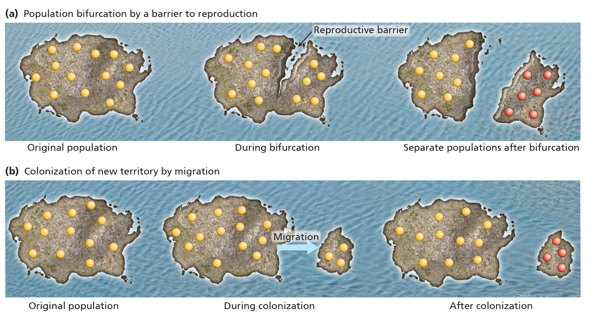
</center>


---

# Allopatric speciation


<center>

.pull-left[

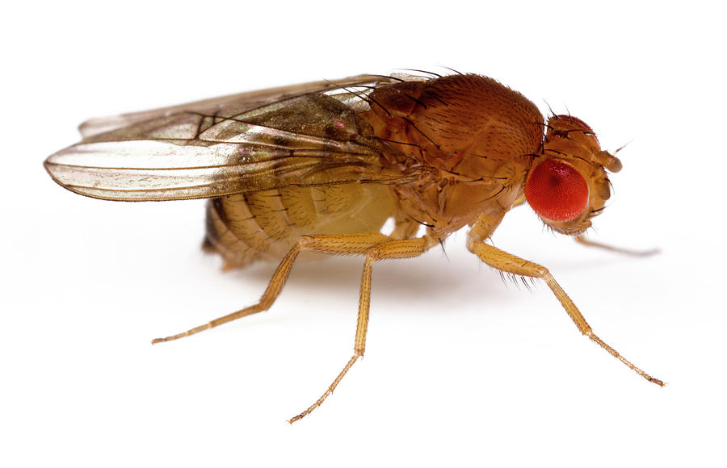

]

.pull-right[


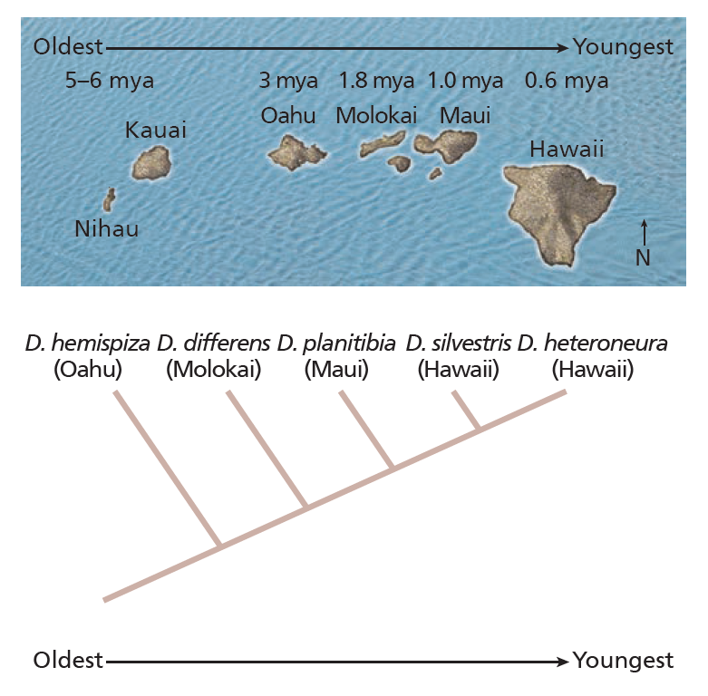
</center>


]

---

# Sympatric speciation


<center>

.pull-left[

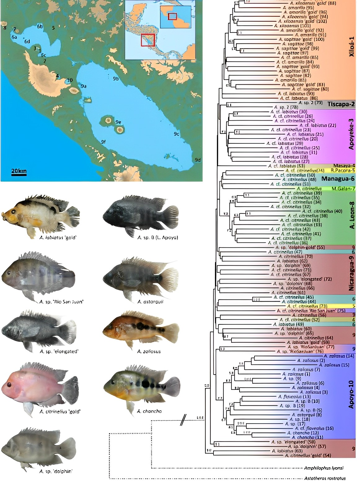

]

.pull-right[


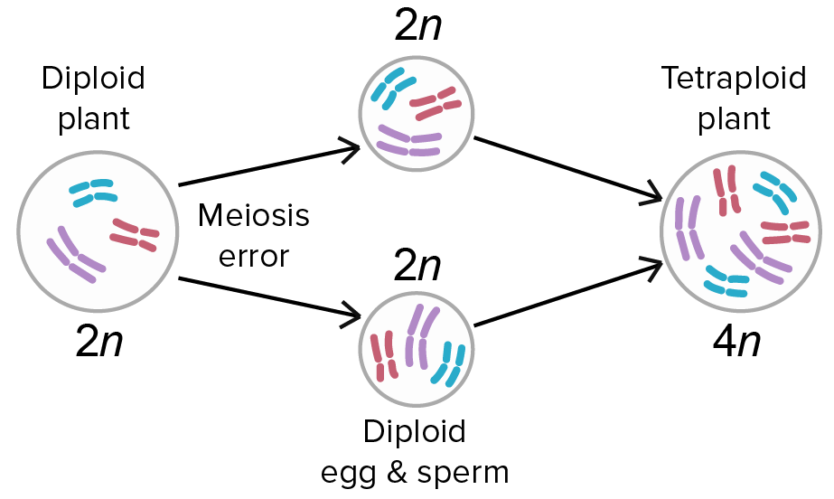

</center>


]

---

# Parapatric speciation

<br>

<center>

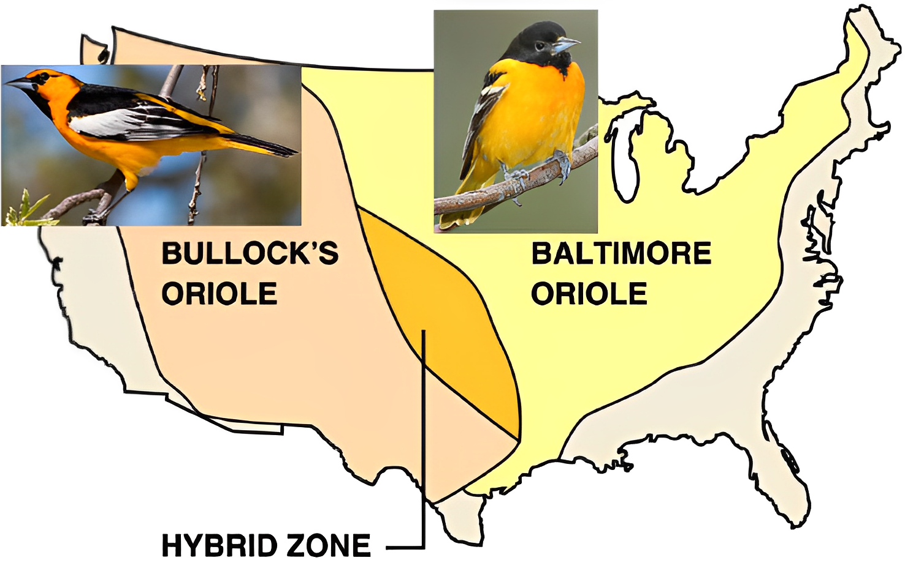

</center>


---

# Limitations - Cryptic species


<center>

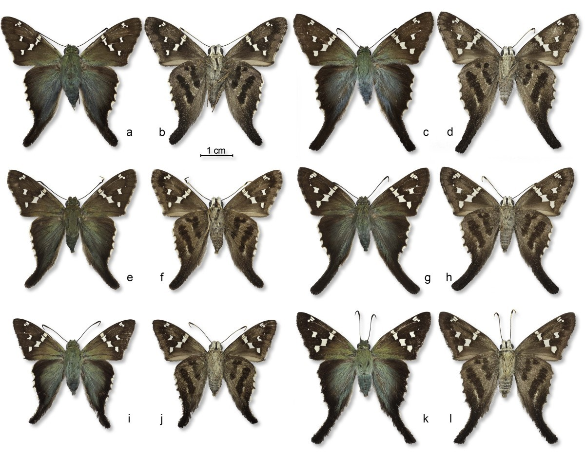

</center>


---
class: center, middle


# Time for the worksheet questions!


